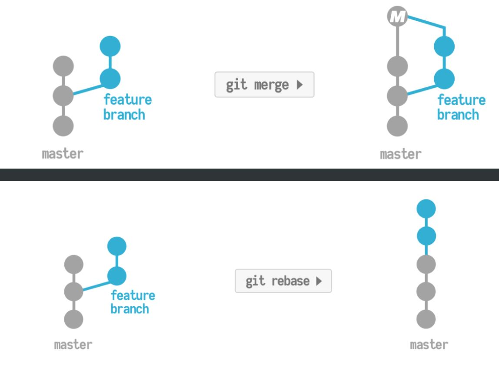

## squash/fixup using rebase

: Combine/meld previous comments into one

- squash - meld into the previous commit


```bash
git rebase -i HEAD~3

```

- \# is ignored that line. Rename the commit message of the new, larger squashed commit


- fixup - discard the commit's log messages

```bash
git rebase -i HEAD~3

```
## amend

: When I'd like to combine untracked files with the last commit


```bash
git add <fileNames or .> // staged files first
git commit --amend (--no-edit )
	//**-no-edit** flag tells Git that you’d like to leave the commit message 
	//of your latest commit unchanged. 
	//If you want to update the commit message(reword), remove this flag.

```

## reword using rebase

: When there is spelling error on your commit messages, I can reword/edit it. 


```bash
git rebase -i HEAD~2 
	//HEAD is pointing the latest commit, the one I want to edit is HEAD~2
	//It means I wnat to operate upon the last two commits back from a HEAD
```

- Change the prefix of that commit from **pick** to **reword.**
    - Vim: i - insert, ESC :wq - save and exit


- Change the commit message here


## delete using rebase

: delete a specific commit message 

```bash
git rebase -i HEAD~3
```

- Change pick to drop


## reorder using rebase

: Reordering commits


```bash
git rebase -i HEAD~3
\\ Reordering the commit lines manually 
```

## split using rebase

: split a commit to multiple commit 

```bash
git rebase -i HEAD~3
// edit
```


- Git automatically goes into special rebase branch mode

```bash
git reset HEAD^ //unstaged all those files
```


- Do git add and commit with new commit messages
- After all done, you get out of the special branch

```bash
git rebase --continue
```

## Merge vs Rebase

- How to do rebase
```bash
git pull 
git checkout -b my_cool_feature //create new branch and move there
// Do add and commits
```

```bash
// when feature is completed
git checkout master
git pull
```


```bash
git checkout my_cool_feature
git rebase master
```


```bash
git checkout master
git rebase my_cool_feature
```


```bash
git push
```
